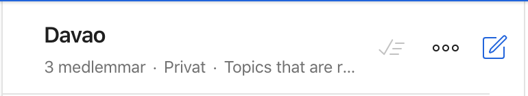
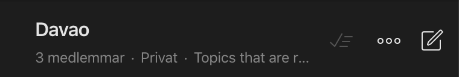
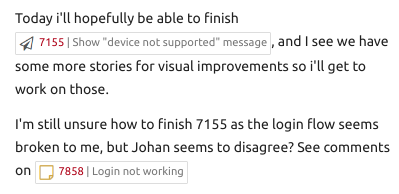
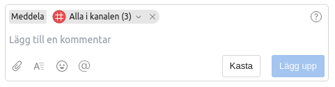
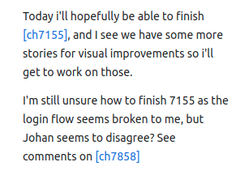

# Changelog

### 2020-09-31

- Removed CSS that hides attachments as Twist has changed their logic and we don't catch all links anymore

### 2020-06-11

- Twist changed so that links are removed when attachments are showing. We are already hiding attachments, so that caused the links to disappear. Fixed by moving the links outside of attachemnts.

### 2020-03-28

- Added support for Clubhouse Epic links

### 2020-03-20

- Update position of create new thread icon and set the right color in dark mode.

  

  

### 2020-03-19

- Speed up Clubhouse requests (streamline calls, 60 second cache)

### 2020-03-17

- Changed clubhouse icons to svgs and updated them so they look correct in dark mode also.

### 2020-03-16

- Changed so that images and previews use resizist so that EXIF is handled correctly. Max height set to 2000px, should be high enough quality for anyone.

### 2020-03-12

- Adjusted the background colors of threads so the app looks good in dark mode.

### 2020-03-11

- Changed so that picture uploads aren't resized, because they get really ugly when blurred.

- Added Clubhouse badges!

### 2020-03-10 Make the commenter's box leaner

### 2020-03-10 Remove Ctrl+Enter sending, as Twist just added it themselves. Change so that commenting box stays open after sending a message.

### 2020-03-09 Added proper links for Clubhouse. Removed the changing of links in general.

